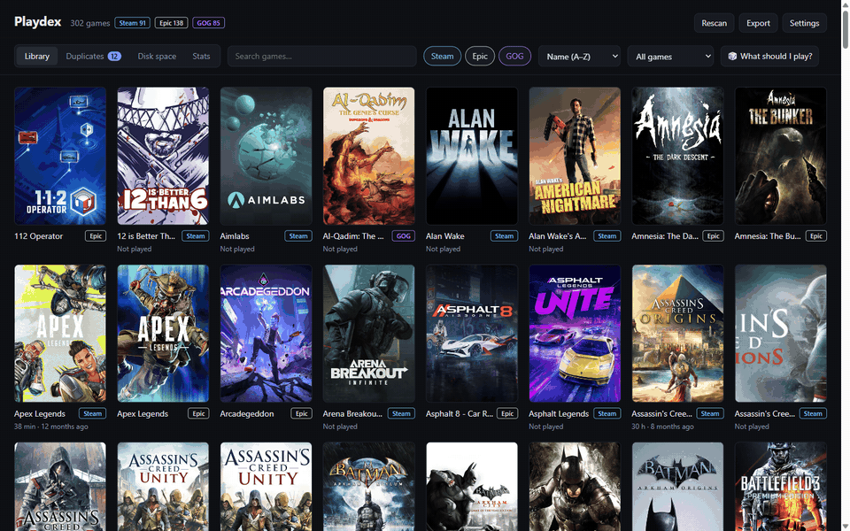
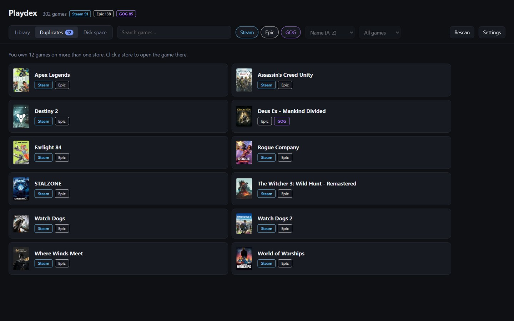
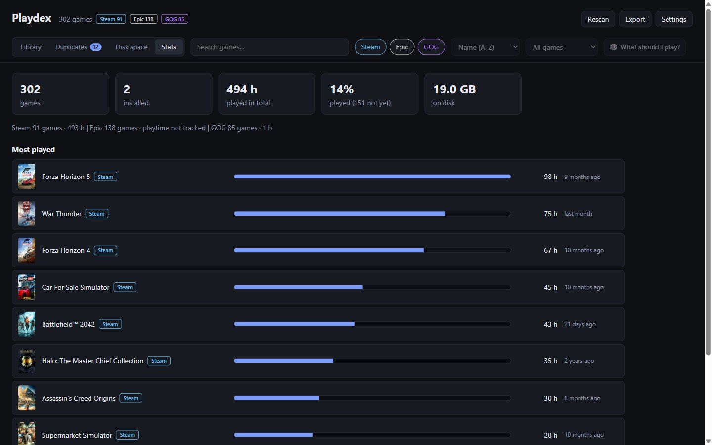
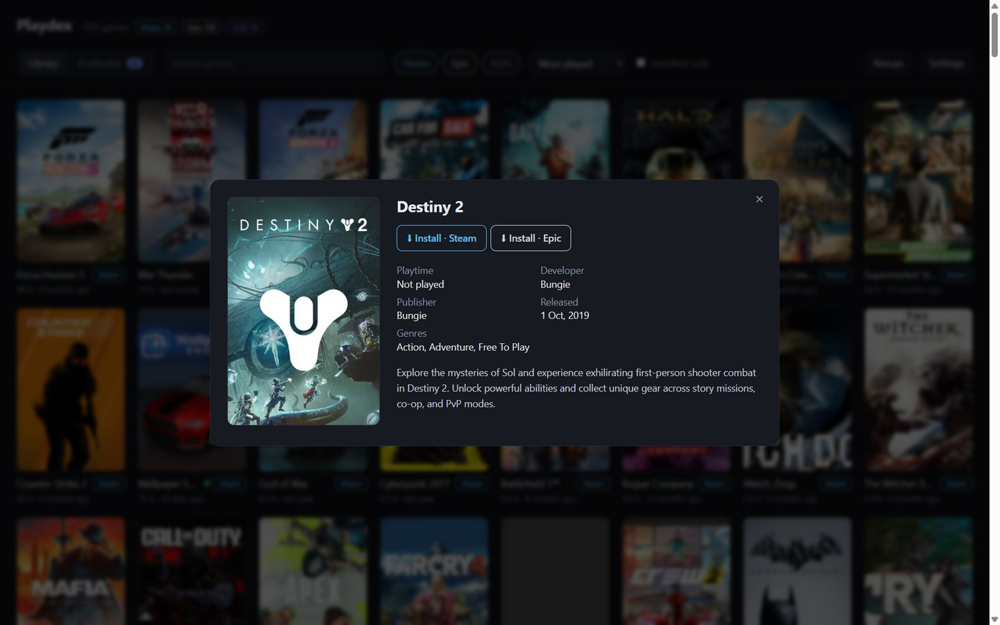

# Playdex

[](https://github.com/Divyansh3105/playdex/actions/workflows/tests.yml)
[](https://github.com/Divyansh3105/playdex/releases/latest)

**All your Steam, Epic and GOG games in one place.**

My games are spread across three launchers. Whenever I wanted to play something, I had to open Steam, then Epic,
then GOG Galaxy, searching each one because I couldn't remember which store had it. Sometimes it turned out I owned
the same game on two of them. Playdex reads every launcher's data on your PC and shows the whole library in one
window: search it once, launch any game through its own store, and see what you own twice.



## Features

- **One library** across Steam, Epic and GOG: no logins, no API keys, nothing uploaded. Counts match each launcher's own.
- **Duplicates:** games you own on more than one store.
- **Playtime and last played** (Steam and GOG), a **Not played** filter, and **🎲 What should I play?** for the backlog.
- **Stats:** totals, hours played, the share of your library you've played, and your most played games.
- **Disk space:** free space per drive, games largest first, and **Uninstall…** through the game's own store.
- **Favorites, hidden games and tags**, **Export** to CSV or JSON, **auto-refresh** and **keyboard shortcuts**.

## Download

<a href="https://apps.microsoft.com/detail/9PMW08P8FQK8?mode=direct"></a>

**Recommended: [Playdex on the Microsoft Store](https://apps.microsoft.com/detail/9PMW08P8FQK8)** (Windows 10/11).
The Store signs it, so it installs without warnings, including on PCs with Smart App Control, and updates itself.

Or get the installer from the [latest release](https://github.com/Divyansh3105/playdex/releases/latest),
or run from source:

```
npm install
npm start        # run from source
npm run dist     # build the installer: dist\Playdex Setup <version>.exe
```

Release installers are built by GitHub Actions (`.github/workflows/release.yml`) when a release is published:
it runs the tests, checks the tag matches `package.json`, builds, and attaches the installer with its SHA-256.

The installer is per-user (no admin needed), lets you choose the folder, and adds Start menu + desktop shortcuts.
Settings live in `%APPDATA%\Playdex` and are kept on uninstall.

**The GitHub installer isn't code-signed.** Windows SmartScreen will warn ("Windows protected your PC" → More info → Run anyway),
and on PCs with **Smart App Control** turned on Windows blocks it entirely. Use the Microsoft Store version there.

## Screenshots








## Design decisions

- **Read each launcher's own files instead of using store APIs.** No logins or keys, works offline, and the counts
  match what each launcher shows. The cost is parsing undocumented formats, such as Steam's binary `appinfo.vdf`
  (`parseAppInfo` in `scan.mjs`). So every counting rule has a test that builds fake launcher folders.
- **Treat launcher data as untrusted.** Epic's and GOG's folders under `C:\ProgramData` can be edited by every Windows
  user. Launch and uninstall commands are built in the main process from exact allowed link shapes (`uriLaunch`),
  nothing runs through a shell, and the page can only send back a game id.
- **Copy GOG Galaxy's database before reading it.** Galaxy keeps it open, so Playdex reads a temporary copy with Node's
  built-in SQLite and never touches the real file.
- **Let the store do the uninstalling.** Playdex never deletes game files. It doesn't run GOG's `unins000.exe` either,
  because that path comes from a database other users can edit.
- **Match duplicates by normalized title** (drop ™/®, edition suffixes like "GOTY", move a trailing ", The").
  Simple and easy to explain; the known limit is games that have a different name on each store (`normalize`).
- **No UI framework and no runtime dependencies** besides Electron: one plain JavaScript file for the page, served
  under a strict Content Security Policy that only allows that file to run.

## Where the data comes from (read-only, no logins)

| Store | Owned games | Installed games |
|---|---|---|
| Steam | `appcache/librarycache` folders; name + type from Steam's own `appcache/appinfo.vdf` | `steamapps/appmanifest_*.acf` |
| Epic | `C:\ProgramData\Epic\EpicGamesLauncher\Data\Catalog\catcache.bin` | `...\Data\Manifests\*.item` |
| GOG | Galaxy's `galaxy-2.0.db` (copied to temp before reading) | same DB |

**Counting** matches what each launcher's library shows:
- Steam: apps of type Game or Application (e.g. Wallpaper Engine), including delisted games; no DLC, tools or test configs.
- Epic: games plus creator/mod kits (e.g. Hogwarts Legacy Creator Kit); no DLC, Unreal Engine or Twinmotion.
- GOG: Galaxy's own `isDlc` / `isVisibleInLibrary` flags, so Amazon Prime/Luna claim stubs, bundle entries and
  superseded releases are left out, just like in Galaxy.

The header total counts a game you own on several stores once; each store badge counts its own copy.

## Optional: exact Steam library

Without a key, Playdex reads Steam's local library cache, which normally matches your Steam library.
If it's ever off (e.g. a game you own but have never opened in the Steam client), use the official API:

1. Get a free key at https://steamcommunity.com/dev/apikey (any domain name works, e.g. `localhost`).
2. In the app, click **Settings**. Explorer opens `%APPDATA%\Playdex\config.json`; paste your key and save:
   ```json
   { "steamApiKey": "YOUR_32_CHARACTER_KEY" }
   ```
3. Click **Rescan**.

Your Steam ID is read from Steam's `config/loginusers.vdf`. To use a different account, add `"steamId": "7656119…"`.
`config.json` is git-ignored. Don't share the key, because it acts on your behalf with the Steam Web API.
If the key fails, the app falls back to the local cache and shows why.

## Playtime and sorting

Each card shows how long you've played and when you last played ("98 h · 9 months ago", or "Not played").
The **Sort** menu orders the library by name, recently played, most played, or installed first, and remembers your choice.
**Show → Not played** lists games you haven't played on any store (Epic games are left out, since their playtime is unknown).
**🎲 What should I play?** opens a random game from the ones shown, preferring installed games. Pair it with Not played
to work through your backlog.

| Store | Playtime and last played |
|---|---|
| Steam | `userdata/<account>/config/localconfig.vdf` (the account matching your Steam ID) |
| GOG | Galaxy's `GameTimes` and `LastPlayedDates` tables |
| Epic | Not available: Epic keeps it only in its encrypted account data, so Epic games show no playtime |

## Favorites, hidden games and tags

In a game's details window: **☆ Favorite**, **Hide from library**, and tags (type one and press Enter; existing
tags are suggested). The **Show** menu filters the library to Installed, Not played, Favorites, Hidden, or any tag.

- They apply per store copy, so you can hide the Epic copy of a game and keep the Steam one.
- Hiding only affects the library view: the launcher counts in the header, Duplicates and Disk space still include everything.
- Saved in `%APPDATA%\Playdex\library.json`. The main process validates everything the page sends (known id
  formats, up to 20 tags of 32 characters per game), saves atomically, and keeps an unreadable file as a backup
  instead of overwriting it.

## Disk space

The **Disk space** tab shows free space on each drive that has games, how much of it your games use, installed
games largest first, and a warning when the same game is installed from two stores.

| Store | Install size |
|---|---|
| Steam | `SizeOnDisk` in each `appmanifest_*.acf` |
| Epic | `InstallSize` in each install manifest |
| GOG | Galaxy doesn't record it: Playdex adds up the files in the install folder, but only after the folder passes the same `goggame-<id>.info` check used for launching |

**Uninstall…** on a row hands off to the store, which does the uninstalling. Playdex never deletes game files itself.

| Store | What Uninstall… does |
|---|---|
| Steam | `steam://uninstall/<appid>`: Steam asks you to confirm |
| Epic | Epic has no uninstall link, so it opens your Epic library: click ⋯ on the game, then Uninstall |
| GOG | Opens the game in Galaxy: settings icon next to Play → Manage installation → Uninstall. (Not the folder's `unins000.exe`: that path comes from a database other Windows users can edit.) |

## Stats

The **Stats** tab totals what the store buttons and search let through: games (counted once across stores),
installed games, hours played, the share of games you've played (Epic left out, as its playtime is unknown),
space on disk, a line per store, and your 10 most played games.

## Export

**Export** saves the library as CSV (opens in Excel or Google Sheets) or JSON. Pick the type in the save dialog.
One row per store copy: store, title, installed, playtime in minutes, last played, size in bytes, drive, favorite,
hidden and tags. Cells that start with `=`, `+`, `-` or `@` get a leading `'` so spreadsheets don't run them as formulas.

## Auto-refresh and keyboard shortcuts

When you come back to Playdex (say, after installing or uninstalling a game in a launcher), it rescans quietly,
at most every 15 seconds, and keeps showing the current view meanwhile.

| Key | Action |
|---|---|
| `/` or Ctrl+F | Search (Esc clears it, Esc again leaves it) |
| 1–4 | Library, Duplicates, Disk space, Stats |
| P | What should I play? |
| F5 | Rescan |
| ? | Show these shortcuts |

## Game details

Clicking a game opens its details: description, developer, publisher, release date and genres, with a
Play/Install button for every store you own it on.

- GOG: all from Galaxy's local database, offline.
- Steam: fetched from the Steam store when you open the game.
- Epic: Epic's local description when it has a real one; otherwise the Steam store page of the same game
  (exact title match only, and labelled as such).

Opening details sends that game's Steam app id or title to `store.steampowered.com`; nothing else leaves your PC.

## Launching

The buttons in the details window open the game through its own launcher (`steam://`, `com.epicgames.launcher://`).
Installed GOG games start directly via `GalaxyClient.exe /command=runGame`, which keeps cloud saves and playtime.
Uninstalled ones open their page in Galaxy.

## Security

- **No network server.** The page talks to the app over Electron IPC (`preload.cjs` exposes a short list of calls),
  and the main process ignores IPC that doesn't come from the app's own page.
- The page runs sandboxed with context isolation and no Node access. It can't navigate away or open windows,
  all permission requests (camera, mic…) are denied, and it's served from `app://playdex/` with a strict
  Content Security Policy: only `app.js` runs, images load only over https, and no referrer is sent.
- Epic's and GOG's data folders are writable by every Windows user, so their contents are treated as untrusted:
  launch commands only accept exact URI shapes (`uriLaunch`), GOG installs must contain their `goggame-<id>.info`,
  and nothing runs through a shell. The page only sends a game id; launch and uninstall commands never leave the main process.
- Remaining risk: another user who can edit Galaxy's database could point an installed game at a different folder
  that has a matching `.info` file. Galaxy itself trusts that database too, so this app adds no new risk there.

- The packaged exe has Electron's hardening fuses set: it can't be run as a plain Node.js runtime
  (`ELECTRON_RUN_AS_NODE`), ignores `NODE_OPTIONS` and `--inspect`, and refuses to start if its `app.asar` was modified.

## Code signing

To sign, add a certificate to electron-builder (`win.signtoolOptions` or Azure Artifact Signing via `win.azureSignOptions`),
then `npm run dist`. A signed installer passes Smart App Control and builds SmartScreen reputation over time.

The Microsoft Store package (`npm run dist:store`, `build.appx` in `package.json`, tiles in `build/appx/`) needs no
certificate: the Store signs it. The Release workflow builds it as a run artifact (or run the workflow by hand).

## Tests

`npm test` runs unit tests (title matching, file parsers, launch validation) and scanner tests that build fake
Steam, Epic and GOG data folders (`tests/fixtures.mjs`) with one entry per counting rule, so changes that would make
Playdex's counts drift from the launchers' fail. UI tests (`tests/ui.test.mjs`) load the page in Microsoft Edge
through Playwright with fake library data and check the Stats math, filters, sorting, shortcuts and favorites.
`npm run typecheck` type-checks the JavaScript with TypeScript (`tsconfig.json`, JSDoc types, no build step);
`types.d.ts` describes the page ↔ main process contract. GitHub Actions runs the type check and all tests on every
push and pull request.
The workflows pin each action to a commit SHA, and Dependabot (`.github/dependabot.yml`) opens weekly PRs to update
those pins and the npm packages.

## License

[MIT](LICENSE) © 2026 Divyansh Garg · [Privacy policy](PRIVACY.md): Playdex collects no data.
